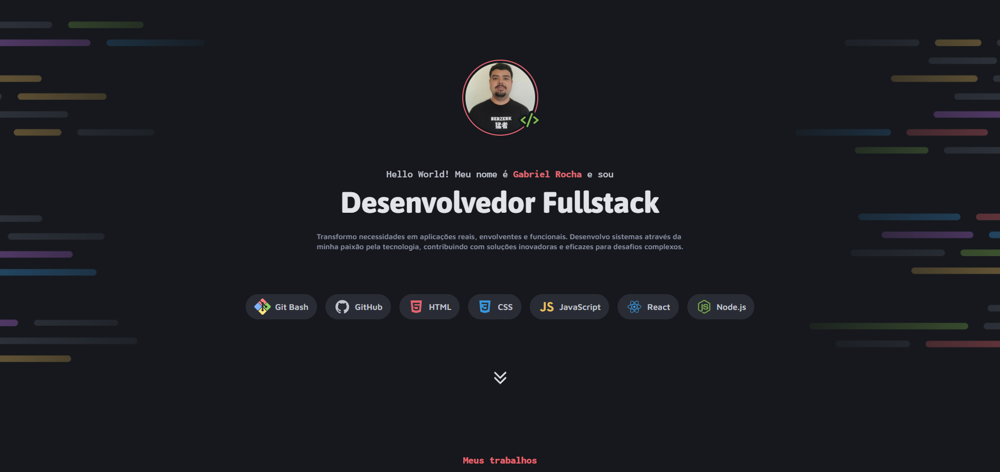

# 🗂️ Portfólio — Gabriel Rocha

> Landing page de portfólio pessoal desenvolvida com HTML, CSS e JavaScript puro.



---

## 📌 Sobre o projeto

Este é o meu portfólio pessoal, onde apresento meus projetos, serviços e formas de contato. O objetivo foi criar uma experiência visual moderna, responsiva e com animações fluidas para destacar o meu trabalho como Desenvolvedor Fullstack.

---

## 🚀 Funcionalidades

- ✅ Apresentação pessoal com animações de entrada
- ✅ Galeria de projetos com botão "Mostrar mais / Mostrar menos"
- ✅ Seção de serviços com cards animados no scroll
- ✅ Seção de contato com links para redes sociais
- ✅ Layout totalmente responsivo (mobile, tablet e desktop)

---

## 🛠️ Tecnologias utilizadas

- **HTML5**
- **CSS3** (com variáveis, nesting e `@keyframes`)
- **JavaScript** (vanilla, sem frameworks)
- **Google Fonts** — Asap, Inconsolata, Maven Pro

---

## 📁 Estrutura de arquivos

```
📦 portfolio
├── index.html
├── style/
│   ├── index.css
│   ├── global.css
│   ├── header.css
│   ├── main.css
│   ├── section-services.css
│   ├── section-links.css
│   ├── responsive.css
│   └── animations.css
├── js/
│   ├── animations.js
│   └── viewMore.js
└── assets/
    ├── images/
    └── icons/
```

---

## 💻 Como rodar localmente

1. Clone este repositório:
   ```bash
   git clone https://github.com/rochacode08/rochacode08.github.io.git
   ```
2. Abra a pasta do projeto no seu editor de código (como o VS Code).
3. Abra o arquivo `index.html` diretamente no navegador **ou** utilize a extensão **Live Server** para rodar com hot-reload.

---

## 👨‍💻 Sobre o autor

Desenvolvido por **Gabriel Rocha**, Desenvolvedor Fullstack. Atualmente aprofundando meus conhecimentos em Tecnologia da Informação e Comunicação na FAETERJ e no ecossistema Full-Stack pela Rocketseat, sempre com foco em criar soluções eficientes e com ótima experiência para o usuário.

---

## 📝 Licença

Este projeto está sob a licença **MIT**. Sinta-se à vontade para usá-lo como inspiração!

---

## 🔗 Acesse o projeto

🌐 **[Ver portfólio online](https://rochacode08.github.io)**

---

## 📬 Contato

<p>
    <a href="mailto:gabrielrocha.devstack@gmail.com">
        
    </a>
    <a href="https://www.linkedin.com/in/gabriel-rocha-devstack" target="_blank">
        
    </a>
    <a href="https://www.instagram.com/gabriel_lopess15/" target="_blank">
        
    </a>
</p>