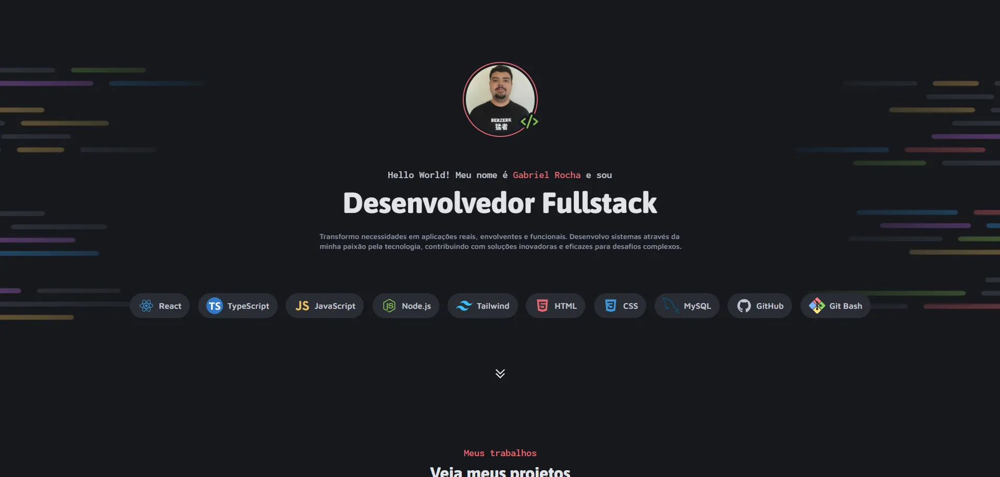
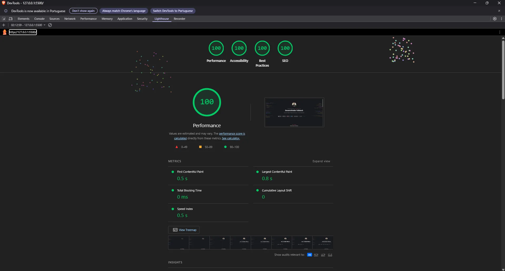
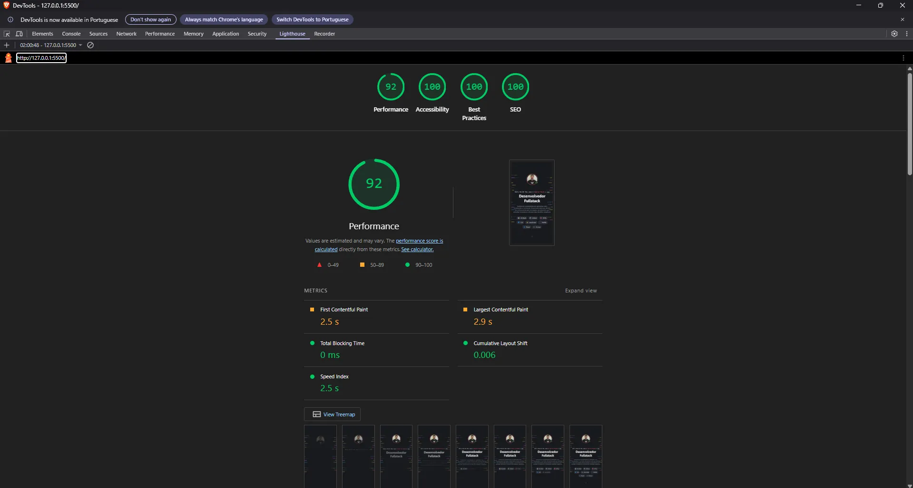

# 🗂️ Portfólio — Gabriel Rocha

Portfólio pessoal desenvolvido para apresentar meus projetos, habilidades e formas de contato. A página é dividida em quatro seções principais: apresentação com stack de tecnologias, galeria de projetos com sistema "mostrar mais/menos", serviços oferecidos e links de contato.

## 📸 Preview



## 🚀 Demonstração

🔗 **[Ver portfólio online](https://rochacode08.github.io)**

## 🛠️ Tecnologias utilizadas

- **HTML5** — estruturação semântica com `<header>`, `<main>`, `<section>` e meta tags Open Graph
- **CSS3** — estilização com animações, CSS Grid, Flexbox, CSS Nesting e variáveis
- **JavaScript (vanilla)** — animações de scroll e sistema de mostrar/esconder projetos
- **Google Fonts** — tipografia com as fontes *Asap* (títulos), *Maven Pro* (texto) e *Inconsolata* (subtítulos)
- **WebP** — formato moderno de imagens para melhor performance

## ✨ Funcionalidades

### 🎭 Seção Apresentação
- ✅ Foto de perfil com ícone de código sobreposto
- ✅ Texto de apresentação com **animações sequenciais de entrada** (fadeIn com delays)
- ✅ **Stack de tecnologias** em formato de tags (Git Bash, GitHub, HTML, CSS, JavaScript, MySQL, React, Node.js)
- ✅ Tags com animação de entrada deslizante (slide-in) em cascata
- ✅ Botão de seta com **animação de bounce** indicando scroll para projetos
- ✅ Scroll suave com easing personalizado ao clicar na seta

### 📁 Seção Projetos
- ✅ Galeria de **16 projetos** com thumbnails coloridos e links externos
- ✅ **Sistema "Mostrar mais/menos"** que calcula automaticamente quantos cards cabem em 2 linhas
- ✅ Recalculo automático da quantidade visível ao **redimensionar a tela** (via `ResizeObserver`)
- ✅ Cards aparecem progressivamente com `IntersectionObserver` (animação ao entrar na viewport)
- ✅ Efeito hover nos cards com outline colorido
- ✅ Bordas superiores coloridas em cards específicos para destaque visual
- ✅ Botão "Mostrar mais" com **animação de pulse** para chamar atenção

### 💼 Seção Serviços
- ✅ **3 cards** apresentando serviços oferecidos (Websites, API/Banco de dados, DevOps)
- ✅ Animação de entrada sequencial nos cards ao entrar na viewport
- ✅ Efeito hover com **shine sweep** (gradiente passando pelo card)
- ✅ Rotação do ícone no hover

### 📬 Seção Contato
- ✅ 4 links para redes sociais e contato (LinkedIn, Instagram, GitHub, E-mail)
- ✅ Efeito hover com deslocamento horizontal e mudança de cor nos ícones
- ✅ Sublinhado animado na parte inferior do link

## 🎨 Paleta de cores

Tema dark com 5 cores de destaque para diferenciar elementos:

| Cor                    | Hex       |
| ---------------------- | --------- |
| ⬛ Base 100 (bg)        | `#0D0E11` |
| ⬛ Base 200             | `#16181D` |
| 🔲 Base 300             | `#292C34` |
| 🔘 Base 400             | `#878EA1` |
| ⚪ Base 500             | `#C0C4CE` |
| ⚪ Base 600             | `#E2E4E9` |
| 🔴 Principal Red        | `#E3646E` |
| 🟣 Principal Purple     | `#BB72E9` |
| 🔵 Principal Blue       | `#3996DB` |
| 🟢 Principal Green      | `#82BC4F` |
| 🟡 Principal Yellow     | `#EABD5F` |

## 📂 Estrutura do projeto

```
📦 rochacode08.github.io
 ┣ 📂 assets
 ┃ ┣ 📂 icons                → Ícones SVG (tecnologias, redes sociais, UI)
 ┃ ┗ 📂 images               → Backgrounds, thumbnails e foto de perfil (WebP)
 ┣ 📂 style
 ┃ ┣ 📜 global.css           → Reset, variáveis e estilos globais
 ┃ ┣ 📜 header.css           → Seção de apresentação
 ┃ ┣ 📜 main.css             → Galeria de projetos e botão mostrar mais
 ┃ ┣ 📜 section-services.css → Seção de serviços
 ┃ ┣ 📜 section-links.css    → Seção de contato
 ┃ ┣ 📜 animations.css       → Animações e keyframes
 ┃ ┗ 📜 responsive.css       → Media queries (6 breakpoints)
 ┣ 📂 js
 ┃ ┣ 📜 animations.js        → IntersectionObserver + scroll suave
 ┃ ┗ 📜 viewMore.js          → Lógica do "mostrar mais/menos"
 ┗ 📜 index.html              → Página principal
```

## 📱 Responsividade

O projeto conta com **6 breakpoints** para suporte a múltiplos tamanhos de tela:

| Dispositivo         | Largura          | Principais ajustes                                  |
| ------------------- | ---------------- | --------------------------------------------------- |
| 🖥️ Desktop XL       | acima de 1680px  | Layout em largura máxima                            |
| 💻 Desktop grande   | até 1440px       | Ajustes de grid e containers                        |
| 💻 Desktop / Tablet | até 1024px       | Ajustes no container, tags e grid de projetos       |
| 📱 Tablet           | até 768px        | Tipografia reduzida, cards em colunas menores       |
| 📱 Mobile           | até 425px        | Links compactos, tipografia fluida com `clamp()`    |
| 📱 Mobile S         | até 375px        | Cards em coluna única, avatar menor                 |
| 📱 Mobile XS        | até 320px        | Títulos menores, tags compactas                     |

## ⚡ Performance

O projeto foi otimizado com foco em Core Web Vitals e auditado pelo **Google Lighthouse**:

### 🖥️ Desktop



### 📱 Mobile



### 🎯 Otimizações aplicadas

- ✅ **Preload + `fetchpriority="high"`** na foto de perfil (Largest Contentful Paint)
- ✅ Conversão de imagens **PNG → WebP** (redução significativa no tamanho dos arquivos)
- ✅ `width` e `height` **explícitos** em todas as imagens (evita Cumulative Layout Shift)
- ✅ `loading="lazy"` em imagens abaixo do fold (carregamento sob demanda)
- ✅ Scripts com **`defer`** (carregam em paralelo, não bloqueiam o render)
- ✅ CSS carregado em **paralelo** (substituindo `@import` em cascata)
- ✅ Fontes do Google **otimizadas** (apenas os pesos realmente utilizados)
- ✅ Contraste **WCAG AA** em todos os elementos interativos

## 💻 Como rodar o projeto

Clone o repositório:

```bash
git clone https://github.com/rochacode08/rochacode08.github.io.git
```

Acesse a pasta do projeto:

```bash
cd rochacode08.github.io
```

Abra o arquivo `index.html` no navegador — ou utilize a extensão **Live Server** do VS Code para recarregamento automático.

## 📚 O que foi trabalhado

### ⚡ JavaScript
- **IntersectionObserver API** para animar elementos ao entrarem na viewport
- **ResizeObserver API** para recalcular layouts dinamicamente
- **Scroll suave customizado** com `requestAnimationFrame` e easing `easeInOutCubic`
- Cálculo dinâmico de quantos cards cabem em 2 linhas do grid
- Controle de estado com variável `isExpanded` para toggle
- Manipulação avançada do DOM e classes

### 🎨 CSS
- **CSS Nesting** nativo em todos os arquivos
- Uso extensivo de **CSS Custom Properties** (variáveis) para cores, fontes e typography scale
- **Animações complexas** com `@keyframes` (fadeIn, slideIn, bounce, pulse, shine)
- Animações com **delays em cascata** usando `nth-child`
- Efeito shine com pseudo-elemento e `background: linear-gradient`
- Sublinhado animado com `transform: scaleX()`
- Filtros CSS (`filter: invert sepia saturate hue-rotate`) para colorir SVGs dinamicamente
- Media queries com múltiplos breakpoints
- Uso de `clamp()` para tipografia fluida em mobile
- Controle fino de `box-sizing` para compatibilizar atributos HTML com padding CSS

### 🌐 HTML
- Estruturação semântica com `<header>`, `<main>`, `<section>`, `<aside>`
- Meta tags **Open Graph** para compartilhamento em redes sociais
- Uso de `aria-label` em links sem texto visível (acessibilidade)
- `rel="noopener noreferrer"` em links externos (segurança)
- Favicon com múltiplos tamanhos (32x32 e Apple Touch Icon)
- Atributos de performance: `preload`, `fetchpriority`, `loading="lazy"`, `defer`

## 🔮 Melhorias futuras

- [ ] Adicionar modo **light mode** com toggle
- [ ] Implementar suporte a múltiplos idiomas (PT-BR / EN)
- [ ] Adicionar filtro/categorias na seção de projetos (HTML/CSS, JS, React, etc.)
- [ ] Adicionar página individual para cada projeto com case study
- [ ] Implementar blog/artigos sobre desenvolvimento
- [ ] Integrar formulário de contato funcional (EmailJS ou similar)
- [ ] Adicionar `prefers-reduced-motion` para acessibilidade
- [ ] Alcançar **100/100** no Lighthouse mobile

## 📝 Licença

Este projeto está sob a licença **MIT**. Sinta-se à vontade para usá-lo como inspiração!

---

## 👨‍💻 Autor
Desenvolvido com 💙 por **[Gabriel Rocha Lopes](https://github.com/rochacode08)**

<a href="mailto:gabrielrocha.devstack@gmail.com">
    
</a>
<a href="https://www.linkedin.com/in/gabriel-rocha-devstack">
    
</a>
<a href="https://www.instagram.com/gabriel_lopess15/">
    
</a>

---